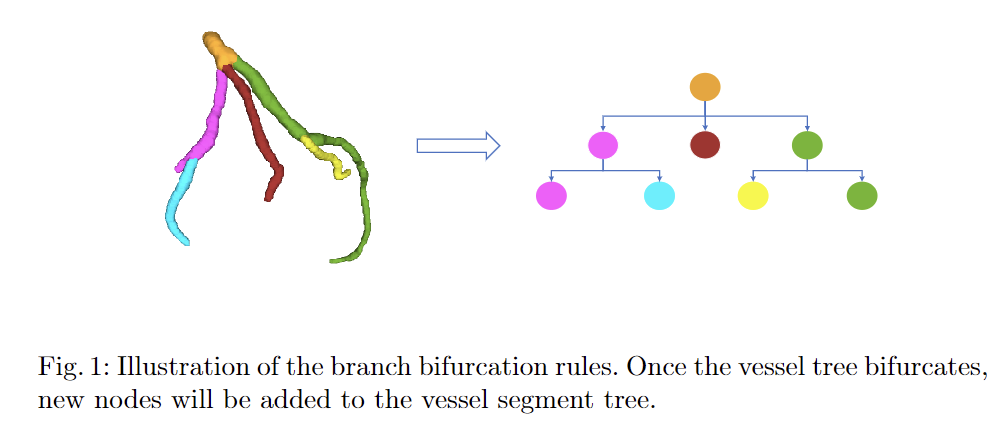

# MICCAI 2023: TopoLab

**Topology-Preserving Automatic Labeling of Coronary Arteries via Anatomy-aware Connection Classifier** \
*Zhixing Zhang\*, Ziwei Zhao\*, Dong Wang, Shishuang Zhao, Yuhang Liu, Jia Liu, Liwei Wang* \
[7/13/2023] [MICCAI 2023] [[Arxiv](http://arxiv.org/abs/2307.11959)]

# Overview

In this repo, we provide labels for the open-source dataset used in the paper "Topology-Preserving Automatic Labeling of Coronary Arteries via Anatomy-aware Connection Classifier".


## Get Started



Given a vessel tree, we can split it into *segments* using *bifurcation rules* illustrated in fig.1. That is, we use consecutive *bifurcation points* to mark the boundary of one vessel segment. Each of the vessel segment has only ONE class. 

In our setting, we only consider the *centerlines* of vessels. Therefore, we only store point sets of vessel centerlines in our label files, and our goal is to classify each of the *centerline segments. The labeling of vessels can be simply done by a knn mapping.

The labels are stored in .json files, and each json has the following structure:

```python
{
  l_points=[{point_set=[[...]], cls=c},...],
  r_points=[{point_set=[[...]], cls=c'},...],
  l_tree=[[x,y],...], 
  r_tree=[[x',y'],...]
}
```

*l_points*: A list containing centerline point coordinates and the vessel segment labels of l_tree. Each element of the list is a dictionary with 2 fields: point_set (all centerline point coordinates of this vessel segment of the shape N*3) and cls (label of this segment).

*r_points*: A list containing centerline point coordinates and the vessel segment labels of r_tree. Each element of the list is a dictionary with 2 fields: point_set (all centerline point coordinates of this vessel segment of the shape N*3) and cls (label of this segment).

*l_tree*: A list storing the structure of l_tree, each element [x, y] is an edge of the tree, where x is the x-th segment in l_points and y is the y-th segment in l_points.

*r_tree*: A list storing the structure of r_tree, each element [x, y] is an edge of the tree, where x is the x-th segment in r_points and y is the y-th segment in r_points.

## How to Use

You need to first download the original open-source dataset.

Then, you need to *align the label files with the images*. The file name of the labels are the same as the corresponding images. Note that you probably need to reverse (and/or) swap the images' axis to align them. Before training your model, you should visualize the images and labels to ensure the alignment is correct.


Here we provide a sample code for alignment:

```python
import os, numpy, json

def load_json(file_path):
    with open(file_path, 'r') as f:
        data = json.load(f)
    return data
def load_image(file_path):
    ...
    return image

img=IMG_PATH
label=LABEL_PATH
out_path=OUT_PATH
os.makedirs(out_path, exist_ok=True)
f=os.listdir(img)
# Somehow filter out irrelevent files in f
for f_ in f:
	fid = f_.split('.')[0]
    image = load_img(os.path.join(img, f_))
    h, w, d = image.shape
    lb = load_json(os.path.join(label, fid+'.json'))
    
    for s in lb['l_points']:
        point=s['point_set']
		# reverse w axis for example
		point[:, 1] = w - point[:, 1]
	for s in lb['r_points']:
        point=s['point_set']
		# reverse w axis for example
		point[:, 1] = w - point[:, 1]
	
	# you can adjust spacing here
	...
	
	np.savez_compressed(os.path.join(out_path, fid+'.npz'), img=image, label=lb)
```


## 🙋‍♀️ Feedback and Contact

If you have any question, feel free to contact zhangzhixing@stu.pku.edu.cn .

## 📝 Citation

If you find this repository useful, please consider citing our paper:

```
TBD
```
